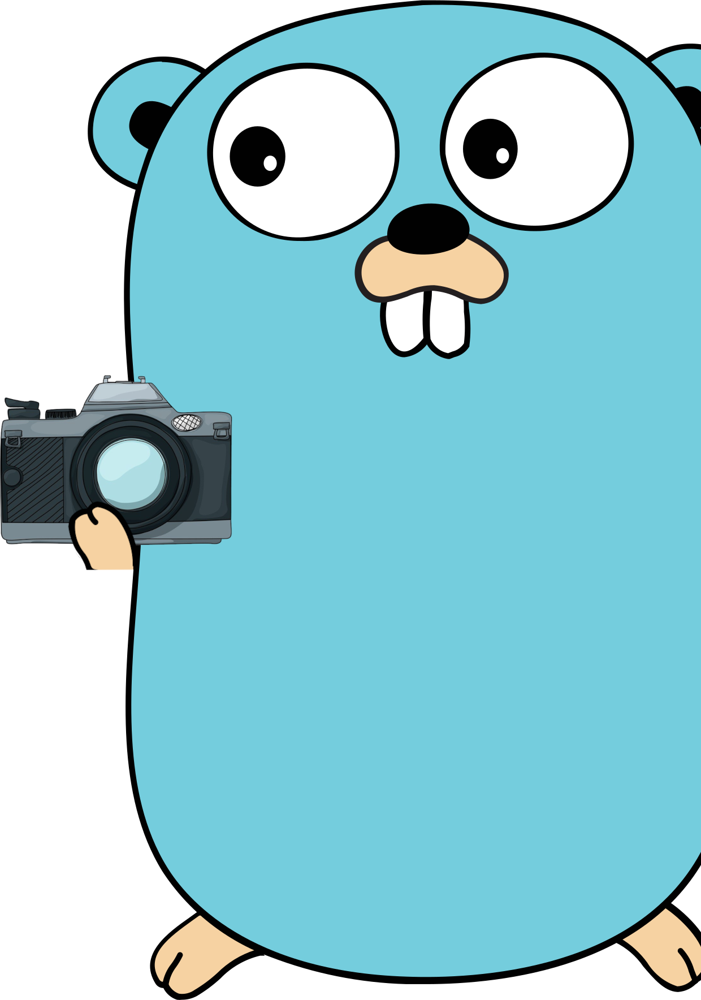

<div align="center">
    
    <h3>A simple script to take screenshots using only CLI</h3>
</div>

## 🚀 Usage:
**If you want to use the properly builded script, check <a href="#setup">setup</a>**

| Command    |     Description    |
| ------------- | ------------------ |
| fullscreen |  Take fullscreen shot (include all monitors)  |
| selection | Take screenshot from a selected area |
| monitor | Take screenshot from only a monitor |
| save | Save the output to a image file |
| clipboard | Copy the output to the clipboard |

&nbsp;
### Example
#### Fullscreen and save to a png file inside your working folder
```bash
goshot -f -S 'image.png'
```
#### Selected area and copy to clipboard
```bash
goshot -s -c
```

<br><br>
<a name="setup"></a>
## 🔧 Setup:
### Clone this repository:<br>
`git clone https://github.com/z3oxs/goshot` or Download ZIP and unzip;<br><br>
### Move to repository:<br>
`cd goshot`<br><br>
### Install (Will need 'make'):<br>
`sudo make install`<br><br>
